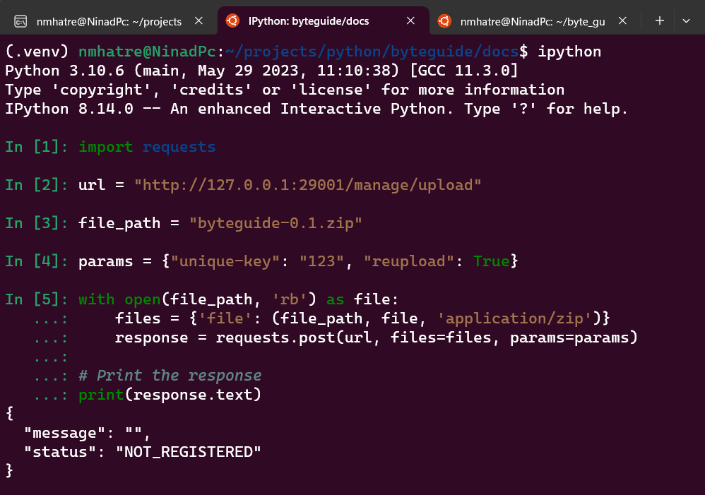
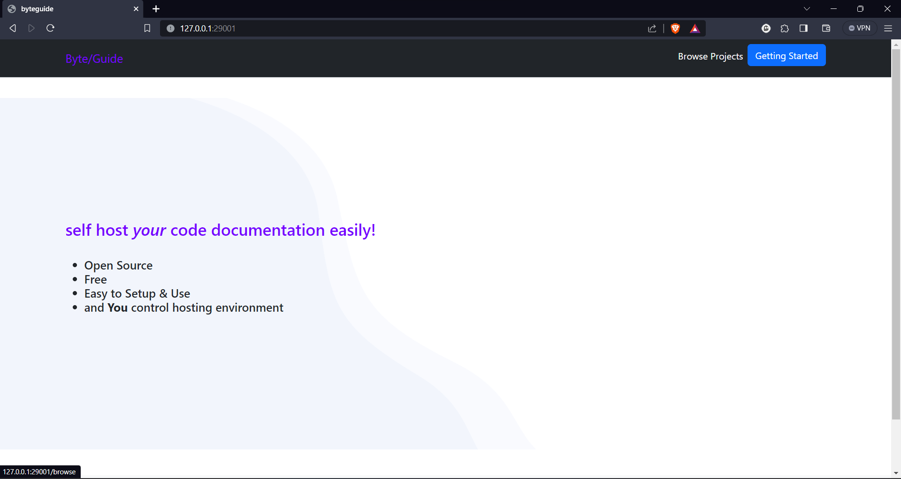
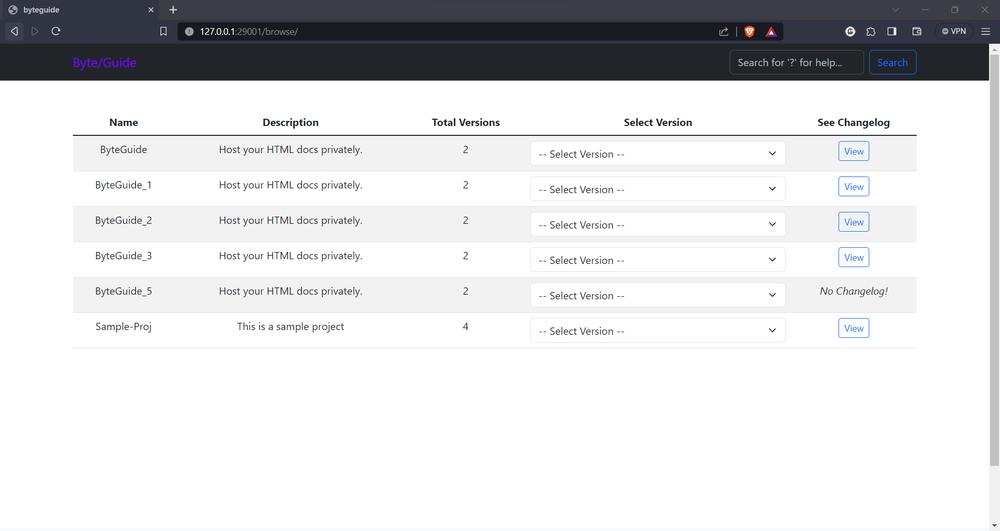
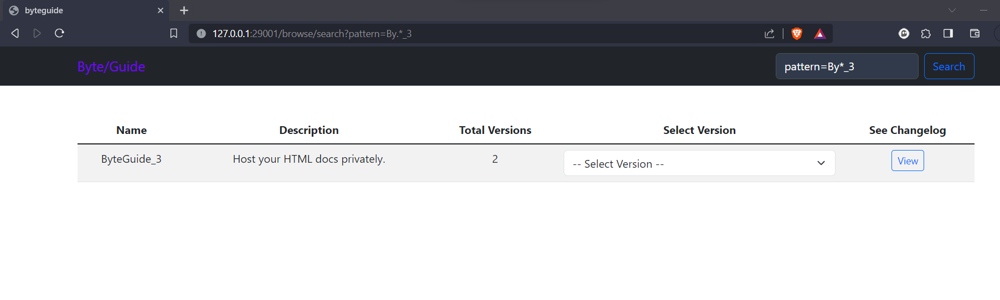
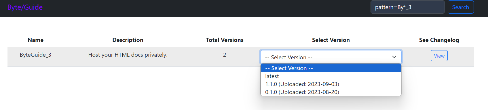
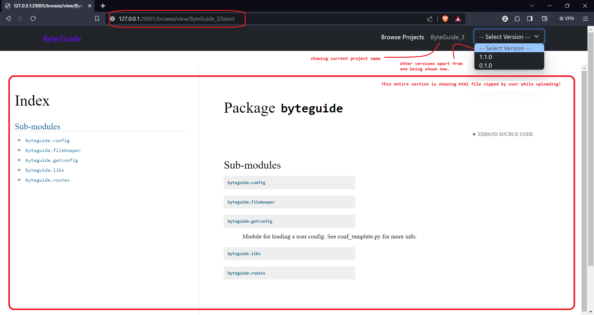
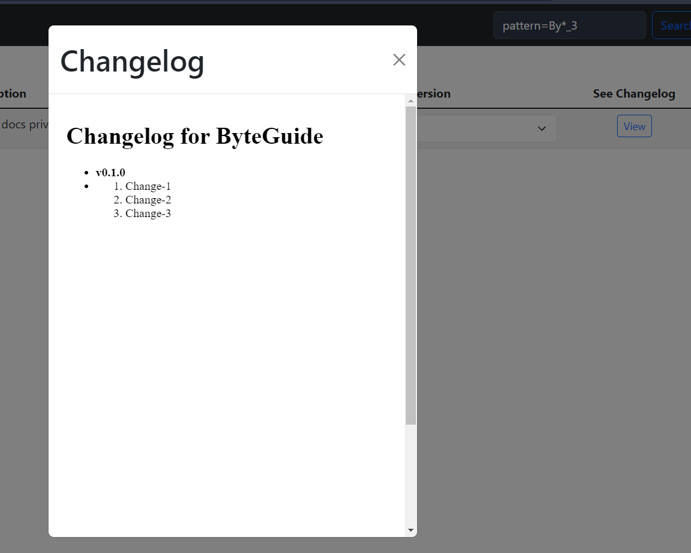

> [!NOTE]
> This branch contains custom configuration. This should be converted to configuration options and merged to the parent repository.


# Byteguide
Solution for hosting your HTML code docs (inspired by hostthedocs)

## Purpose

Created out of my personal need to host the code documents locally. It's created with following things

1. Documents must be hosted locally or internally.
2. Host limited number of projects (Few 100s).
3. Easy to upload docs with Curl
4. Host HTML docs of any programming language.

> It's not created to replace Confluence or similar hosting solutions.

## Getting Started

To start ByteGuide on your local machine, follow the steps below.

### Prerequisites

[Python](https://www.python.org/downloads/) 3.8 or larger is required to run ByteGuide. You can check your Python version by running `python --version` in your terminal.

### Using Poetry

1. Install [Poetry](https://python-poetry.org/docs/#installation).
2. Git clone the repository and `cd` into it.
3. Run `poetry install` to install the dependencies in a virtual environment.
4. Run `poetry run python start_server.py` to start the server. With default settings you will find the server running at `http://localhost:29001`. With hot reload enabled.

Next go to the address of the server in your browser and you should see the landing page. Click on the `Getting Started` button in the upper right corner to read the documentation.

### Configuration

ByteGuide can be configured by editing the configuration files located in the `byteguide/config` directory. There are three files:

* **default.py**: This is the default configuration file. Values from this file can be overridden in environment-specific files.

* **development.py**: This file overrides values from `default.py` if the environment variable `BYTEGUIDE_RUNENV` is set to `dev`.

* **production.py**: This file overrides values from `default.py` if the environment variable `BYTEGUIDE_RUNENV` is set to `prod`.

**Configuration Properties**

The following table lists the configuration properties available in `default.py`.

| Property Name | Description (Data Type, Example) |
|---|---|
| `docfiles_dir` | Path where document files will be saved. (pathlib.Path, Path("/home/nmhatre/byte_guide_docs")) |
| `docfiles_link_root` | Link or WebPath to use to access document files. (str, /static/docfiles) |
| `copyright` | The copyright message to display. (str, None) |
| `title` | The title to display on the browser tab. (str, ByteGuide) |
| `intro_line1` | Landing page intro line 1. Supports HTML code! (str, "Self host your code documentation easily!") |
| `intro_line2` | Landing page intro line 2. Supports HTML code! (str, "") |
| `footer` | The footer message. (str, "Created with ByteGuide! All Rights Reserved") |
| `host` | The hostname to use to run the ByteGuide server (for development only). (str, "127.0.0.1") |
| `port` | The port to run the ByteGuide server on. (int, 29000) |
| `debug` | Whether to run in debug mode (for local development). (bool, False) |
| `readonly` | Whether to allow deletion of existing files. (bool, True) |
| `disable_delete` | Whether to disable deletion altogether. (bool, False) |
| `max_content_mb` | The maximum size of the project documentation .zip file (in megabytes). (int, 10) |
| `enable_email_notification` (unused) | Whether to enable email notifications. (bool, False) |
| `smtp_server` (unused) | The SMTP server to use for email notifications. (str, None) |
| `smtp_port` (unused) | The SMTP port to use for email notifications. (int, 587) |
| `smtp_username` (unused) | The username to use for email notifications. (str, None) |
| `smtp_password` (unused) | The password to use for email notifications. (str, None)

### Running the server in production

To run the server in production, start by setting the `BYTEGUIDE_RUNENV` environment variable to `prod`. This will enable the production settings in byteguide/config/production.py. Next run the server with gunicon using the following command:

```bash
poetry run gunicorn -w 2 -b 0.0.0.0:8000 start_server:app
```

Change the number of workers and the address and port to suit your needs.

## Screenshots

### 1. Upload



### 2. Landing Page



### 3. Browse Projects



### 4. Search



### 5. Version Selection



### 6. Viewing Docs



### 7. Changelog


